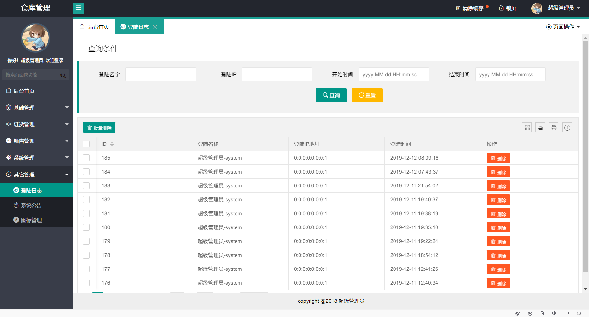

### 安装配置

- 将根目录SQL文件导入数据库
- 在application.yml修改自己使用的数据源

```yml
#配置数据源的属性
spring:
  datasource:
    druid:
      driver-class-name: com.mysql.cj.jdbc.Driver
      url: jdbc:mysql://localhost:3306/erp1207?useUnicode=true&characterEncoding=utf8&useSSL=true&serverTimezone=UTC
      username: root
      password: 123456
```

- 运行ErpApplication

- 浏览器访问以下网址，进入登陆界面

  ```java
  http://localhost:8080
  ```

  

- 超级管理员用户名：system   密码：123456

### 登陆界面


### 主页面

